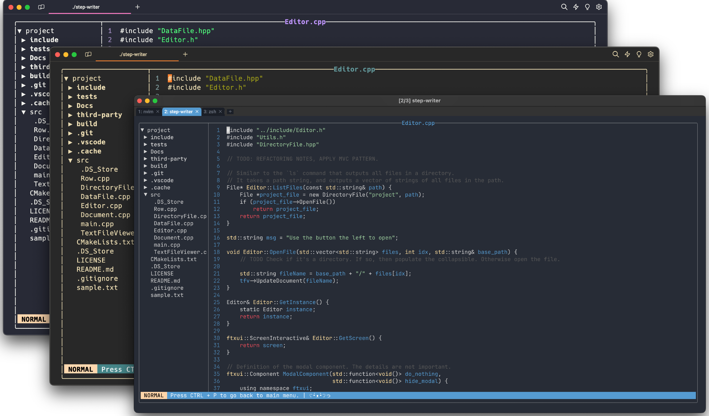
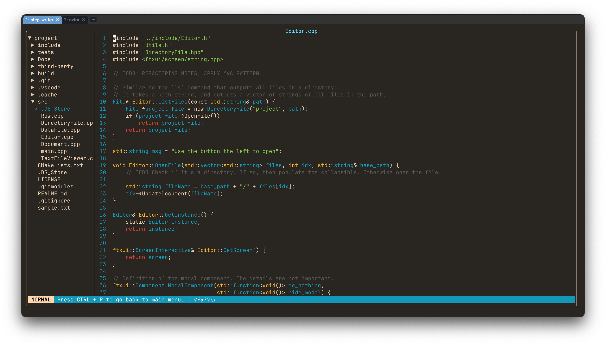
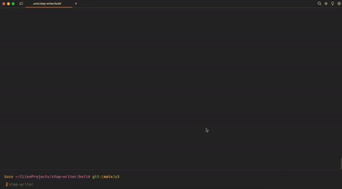
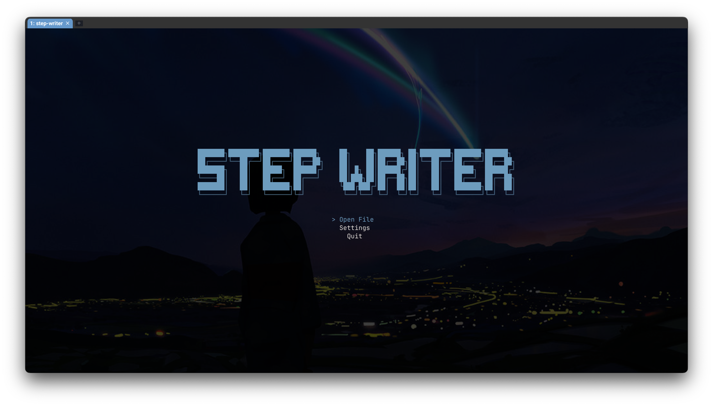

<h1 align="center"> STEP-WRITER </h1>

<h3 align="center">🤓 Shared Text Editor Program - Writer. 
A Lightweight & Simple C++ TUI Text Editor. </h3>

# Overview.
Step-Writer is a TUI text editor. Which *simulates* vim motions and other customizable features. 
I am doing this because the remote servers at UBC does not have neovim installed... So why not make my own text editor.

**Implemented Features:**
- Selectable title screen logos!
- `h`, `j`, `k`, `l` movements in normal mode.
- Enter insert mode by pressing `i`.
- Press `enter` on the file in the explorer in order to open the file.
- Press `q` to return to main menu. (Probably should change that...)
- You can add your own features by going into the `TextFileViewer.cpp` file.
- Syntax Highlighting using Tree Sitter. (Will improve)
- Saving file. `ctrl + p` saves and quits.
- File Explorer navigation with collapsible tabs.
- Status Bar indicating the mode (INSERT, NORMAL, VISUAL)

Figure 1. Overview of the project using Wezterm

I'll try to update this [blog](https://www.brianmoniaga.com/Blog/posts/stepwriter/) which should contain a better documentation and progress of the state of the application. (Though, I have a bad schedule of updating said site.)

Below, you can see this editor editing it's own source code as per the tradition!

Figure 2. Editing it's own source code.

# Installation.
1. Clone the project using `git clone --recurse-submodules https://github.com/BrianAnakPintar/step-writer.git`
2. Once cloned go to the `step-writer` folder, create a `build` directory by typing `mkdir build` and go to that directory by running `cd build`
3. Next, run `cmake ..`
4. Make the program by running `make`
5. Finally, run the program `./step-writer <path>` from the build directory.

If you have already cloned the project without using the `--recurse-submodules` flag, then
1. Clone the project (Assuming it's not already cloned)
2. Once you have cloned, go into the `step-writer` folder using `cd step-writer`
3. Run `git submodule update --init --recursive`
4. Go back to the `step-writer` directory and create a `build` directory by typing `mkdir build` and go to that directory by running `cd build`
5. Next, run `cmake ..`
6. Make the program by running `make`
7. Finally, run the program `./step-writer <path>` from the build directory.

### Todo (soo many things to do ;-;)
- [x] Better file view hierarchy enabling users to see project structures and directory contents.
- [x] Fix simple line deletion bugs.
- [ ] A working terminal.
- [ ] Better cursor movement.
- [x] Syntax Highlighting (Sort of).
  - [x] Basic syntax highlighting.
  - [ ] Implement colors for ALL types.
  - [ ] Update syntax tree when user inputs a line.
  - [ ] Use TSCursor for movement
  - [ ] Use TSInputEdit changing existing tree rather than reparsing everything from scratch.
- [ ] Use a ~~rope~~ gap buffer data structure.
- [ ] Search functionality
- [ ] `ctrl + c` and `ctrl + v` functionality. The OP copy + paste
- [ ] REFACTOR, REFACTOR, REFACTOR! So many cleanup to do 😭
- [ ] Custom keybindings
- [ ]  Settings menu
- [ ]  `ctrl + z` UNDO functionality.

# Acknowledgements
The project uses [FTXUI](https://github.com/ArthurSonzogni/FTXUI) for the terminal UI components, 
it is a very cool TUI library that anyone planning to make a TUI application in C++ should consider using. Aside from that it also uses [Tree-Sitter](https://github.com/tree-sitter/tree-sitter) which is an incremental parsing system that I use for syntax highlighting.

# OLD DEMOS

Video of trying to implement syntax higlighting, encountering indexing bugs.

