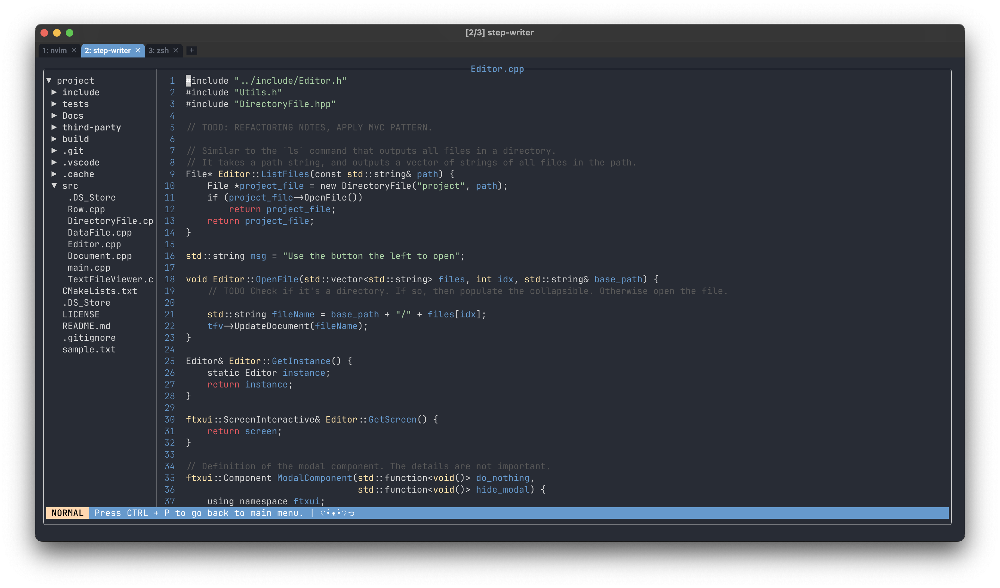
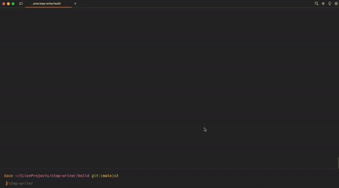

# STEP-Writer
### ~~Scuffed~~ Shared Text Editor Program - Writer.
### A Lightweight & Simple C++ TUI Text Editor. 

# Overview.
Step-Writer is a TUI text editor. Which *simulates* vim motions and other customizable features. 
I am doing this because the remote servers at UBC does not have neovim installed... So why not make my own text editor.

**Implemented Features:**
- Selectable title screen logos!
- `h`, `j`, `k`, `l` movements in normal mode.
- Enter insert mode by pressing `i`.
- Press `enter` on the file in the explorer in order to open the file.
- Press `q` to return to main menu. (Probably should change that...)
- You can add your own features by going into the `TextFileViewer.cpp` file.
- Syntax Highlighting using Tree Sitter. (Will improve)
- Saving file. `ctrl + p` saves and quits.
- File Explorer navigation with collapsible tabs.
- Status Bar indicating the mode (INSERT, NORMAL, VISUAL)

Figure 1. Overview of the project using Wezterm

The project uses [FTXUI](https://github.com/ArthurSonzogni/FTXUI) for the terminal UI components, 
it is a very cool TUI library that anyone planning to make a TUI application in C++ should consider using.

# Installation.
1. Clone the project
2. Once cloned, create a `build` directory by typing `mkdir build` and go to that directory by running `cd build`
3. Next, run `cmake ..`
4. Make the program by running `make`
5. Finally, run the program `./step-writer` from the build directory.

### Todo (soo many things to do ;-;)
- [x] Better file view hierarchy enabling users to see project structures and directory contents.
- [x] Fix simple line deletion bugs.
- [ ] A working terminal.
- [ ] Better cursor movement.
- [ ] Syntax Highlighting (Sort of).
  - [x] Basic syntax highlighting.
  - [ ] Implement colors for ALL types.
  - [ ] Update syntax tree when user inputs a line.
- [ ] Use a ~~rope~~ gap buffer data structure.
- [ ] Search functionality
- [ ] `ctrl + c` and `ctrl + v` functionality. The OP copy + paste
- [ ] REFACTOR, REFACTOR, REFACTOR! So many cleanup to do 😭
- [ ] Custom keybindings
- [ ]  Settings menu
- [ ]  `ctrl + z` UNDO functionality.

# OLD DEMOS

Overview of the project using Warp

Overview of the project using Warp

